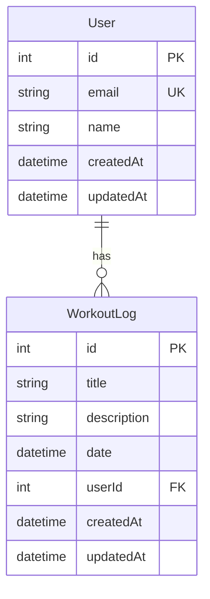

# Boostcoach ERD

```mermaid
erDiagram
    User ||--o{ WorkoutLog : has
    User {
        int id PK
        string email UK
        string name
        datetime createdAt
        datetime updatedAt
    }
    WorkoutLog {
        int id PK
        string title
        string description
        datetime date
        int userId FK
        datetime createdAt
        datetime updatedAt
    }
```